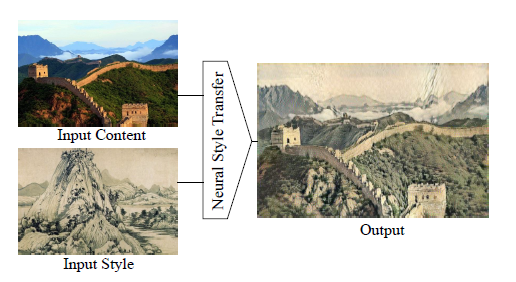
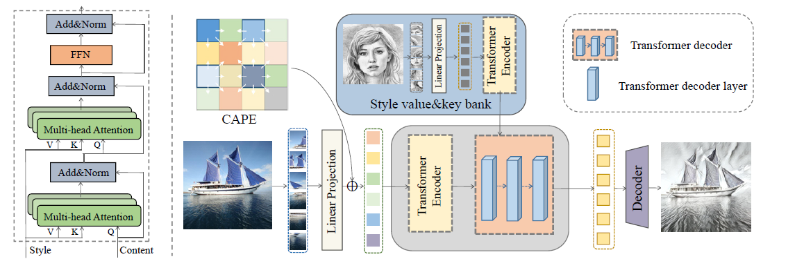

# **Neural Style Transfer**

Yisi Liu, Yujie Zhao, Yuanteng Chen, Xunzhe Zhou

model checkpoint: [NST_best.pth](https://drive.google.com/file/d/1XNZxZVhc-PNaR4AW0BYxZq-QnJRNE5T1/view?usp=sharing)

For inference time, please check `\code\inference.ipynb` for demo

For training, please check `\code\trainer.py` and `\code\main.py` for the training pipeline

# Overview

Neural Style Transfer (NST) is a classical vision task, where the system takes in two images: one is the content image *Ic* , the other is the style image *Is*. The goal here is to generate a new image *Ig*, s.t. *Ig* has the same content as *Ic*, but also has the style of *Is*. Figure 1 [[1]](https://arxiv.org/abs/1705.04058) gives an example.

###### Figure 1. an example of the NST system transferring the style of a Chinese painting onto a given image

# **Base Generative Model**

We choose the classical image-optimization-based algorithm [[2]](https://arxiv.org/abs/1508.06576) as our baseline, where *Ig* is initialized as random noise of the same size as *Ic* and *Is*. Then the three images are sent into a pretrained frozen VGG network to obtain several activations. By minimizing the MSE between the activations of *Ig* and *Ic*, and the MSE of the [gram matrices](https://arxiv.org/abs/1508.06576) of activations of *Ig* and *Is*, we can generate *Ig* with the same contents of *Ic* and the style of *Is*.

The problem of the above method is that it is extremely slow, because in order to generate a new image, we not only need to do forward pass into the VGG, but also need to do backprop on the input *Ig* and update it for hundreds of iterations. This update happens _during_ inference, so it takes forever to generate one image.

In order to quickly generate high-quality style-transferred images, we look into StyTr2[[3]](https://arxiv.org/abs/2105.14576), which is a transformer-based NST algorithm shown in Figure 2.

###### Figure 2. model architecture of StyTr2, taken from the original paper

The key takeaway is that both *Ic* and *Is* are first encoded by transformer encoders, and then the output sequences are combined by a transformer decoder doing cross attention, then finally a CNN decoder outputs the generated image *Ig*. During training, *Ig*, together with *Ic* and *Is*, are sent into a loss net, whose architecture is the same as the image-optimization-based pipeline, to calculate the loss and backprop. After training, just by simply doing a forward pass, we can get the generated images.

In the original paper, the two transformer encoders are trained from scratch, which takes 160,000 iterations to converge. We propose to use the pretrained ViT as the two transformer encoders, then do fine-tuning to reduce training time.

# Dataset

[COCO](https://cocodataset.org/#download) is used as the content dataset and [WikiArt](https://datasets.activeloop.ai/docs/ml/datasets/wiki-art-dataset/) is used as the style dataset.

# Resource Budget

2 x Nvidia RTX A6000 (48GB each)

# **Code Bases**

Our group code base: https://github.com/Zhouxunzhe/NST-Project

The original StyTr2 code base: [diyiiyiii/StyTR-2: StyTr2 : Image Style Transfer with Transformers (github.com)](https://github.com/diyiiyiii/StyTR-2)

